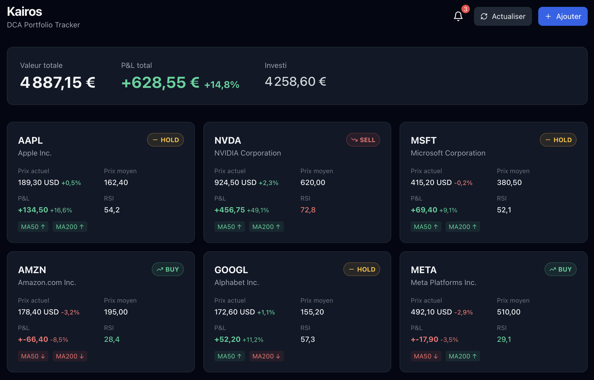

# Kairos — DCA Portfolio Tracker

Outil personnel de suivi de portefeuille DCA (Dollar Cost Averaging).  
Savoir quand renforcer et quand sortir d'une position, basé sur l'analyse technique et des règles personnalisées.


> *Données fictives à titre d'illustration*

---

## Fonctionnalités

- **Signaux automatiques** — BUY / HOLD / SELL calculés en temps réel (RSI, MA50, MA200, stop loss, take profit)
- **Prix en direct** — WebSocket, mise à jour toutes les 60s pendant les heures de marché
- **Alertes email** — notification à chaque changement de signal (via Resend)
- **Import Trade Republic** — script d'import automatique de tes positions depuis l'app TR
- **Graphiques** — courbe de prix avec MA50/MA200, RSI avec zones 30/70
- **Historique DCA** — P&L par lot, prix moyen calculé automatiquement

---

## Stack

| Couche | Tech |
|--------|------|
| Backend | FastAPI, SQLAlchemy async, Alembic |
| Frontend | React, Vite, TanStack Query, Recharts, Tailwind |
| Base de données | PostgreSQL |
| Données marché | yfinance + pandas-ta |
| Emails | Resend |
| Infra | Docker + docker-compose |

---

## Démarrage rapide

### Prérequis
- Docker + docker-compose
- Un compte [Resend](https://resend.com) pour les alertes email (optionnel)

### Installation

```bash
git clone <repo>
cd dca-tracker

cp .env.example .env
# Éditer .env : ajouter RESEND_API_KEY et ALERT_EMAIL

docker-compose up -d
```

### Migrations

```bash
docker-compose exec backend alembic upgrade head
```

Ouvre **http://localhost:5180**

---

## Import Trade Republic

Pour importer automatiquement tes positions depuis Trade Republic :

```bash
python -m venv .venv_scripts
source .venv_scripts/bin/activate
pip install pytr requests
python scripts/import_tr.py
```

Le script gère l'authentification (téléphone + PIN + OTP) et crée toutes tes positions dans Kairos.

---

## Logique des signaux

| Signal | Condition |
|--------|-----------|
| **SELL** | Stop loss atteint, ou take profit atteint, ou RSI > 70, ou prix < MA50 & MA200 |
| **BUY** | RSI < 30 (survente) |
| **HOLD** | Prix > MA50 & MA200 (tendance haussière) |

Les alertes email ne sont envoyées qu'en cas de **changement** de signal.

---

## Configuration

| Variable | Description | Défaut |
|----------|-------------|--------|
| `DATABASE_URL` | URL PostgreSQL | — |
| `RESEND_API_KEY` | Clé API Resend | — |
| `ALERT_EMAIL` | Email de destination | — |
| `PRICE_REFRESH_INTERVAL` | Intervalle de rafraîchissement (secondes) | 60 |

---

## Tickers supportés

Tous les tickers yfinance sont supportés :

```
MU, ANET          # Actions US
ASML.AS           # Actions EU (Amsterdam)
SXR8.DE, 4GLD.DE  # ETFs (Frankfurt)
SOL-USD           # Crypto
```

---

## Usage local uniquement

Pas d'authentification — conçu pour tourner en local sur ta machine.
